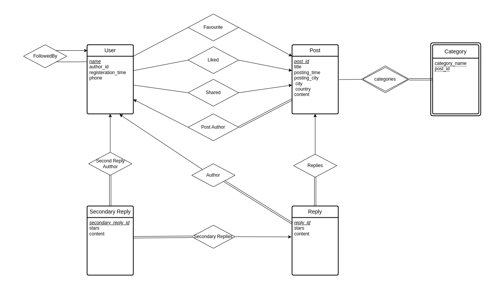
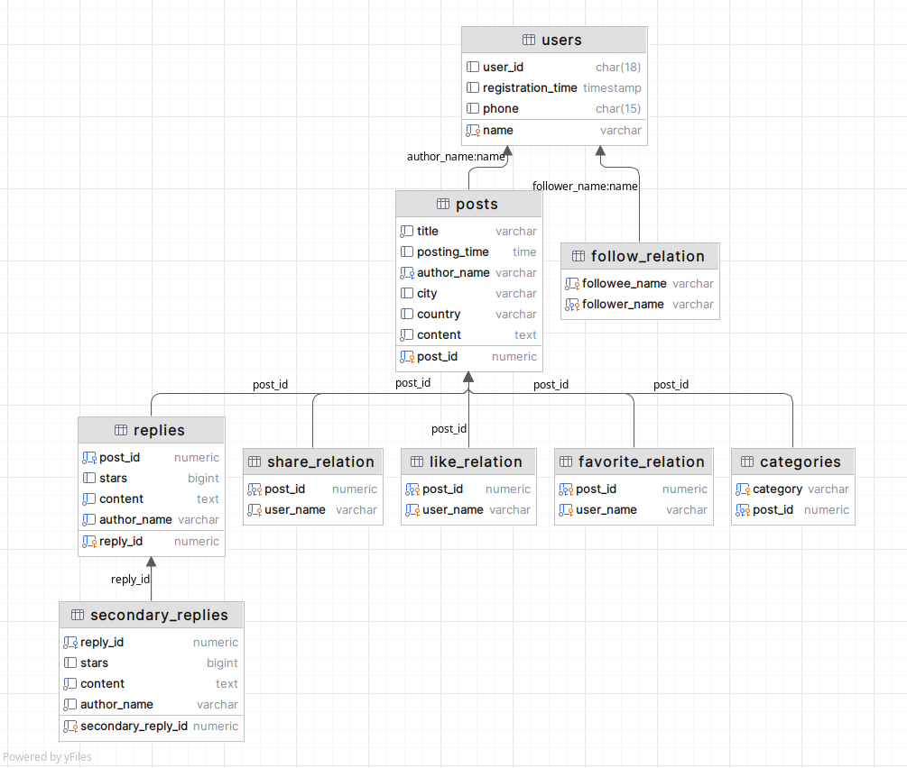

# Project 1
>
>贾禹帆，栾钦策

## ER Diagram

>drew by draw.io

## Database Design

- users: 存储所有用户
  - name 唯一用户名
  - user_id 用户id (身份证号,不存在时为null.为未实名状态)
  - registration_time 注册时间(不存在时按数据导入时间算)
  - phone 手机号
- posts: 存储所有post
  - post_id 唯一id
  - title 标题
  - posting_time post 发布时间
  - author_name post author 用户名
  - city 发布城市
  - country 发布国家
  - content post内容
- replies: 存储所有reply
  - reply_id 自增唯一id
  - post_id 所属post的id
  - stars
  - content reply 内容
- secondary_replies: 存储所有secondary reply
  - secondary_reply_id: 自增唯一id,primary key
  - reply_id: 所属reply的id, foreign key
  - stars
  - content secondary reply 内容
- categories: 存储post类别
  - category 类别名
  - post_id
- follow_relation: 记录用户间关注信息
  - followee_name 被关注者的username
  - follower_name 关注者的username
  - primary key(followee_name,follower_name)
- share_relation: 记录用户分享post信息
  - post_id 分享的post_id
  - user_name 用户名
- favorite_relation: 记录用户favorite post信息
  - post_id favorite的post_id
  - user_name 用户名
- like_relation: 记录用户like post信息
  - post_id like的post_id
  - user_name 用户名

>SQL文件见 `SQL/gen-table.sql`

## Data Import

### Basic

#### java

#### node.js

1. 读取 `posts.json`&`replies.json`&`user-info.json` 并解析
2. 打开连接并使用 query 插入数据，先插入 post，等待所有 promise 返回后再插入 reply。全部返回后，关闭连接，退出程序。

### Advanced

#### java

#### node.js
optomize:
1. 使用 pool 代替 client 进行多客户端流水线插入。由于数据库操作的原子性，一个操作再完成前不可见。由于node的异步io导致两处地方同时（极短时间内）创建不存在的同一个user触发constrain产生插入异常，属于正常现象，捕获即可。
2. 通过`begin; ... end;` 关闭自动提交来进行批量提交，仅适用于数据较为规范，插入出错较少的情况。一旦出错，需要回滚上次所有批量操作并且全部进行单次插入。(~~要做字符串拼接改的有点多就懒得弄了~~)

