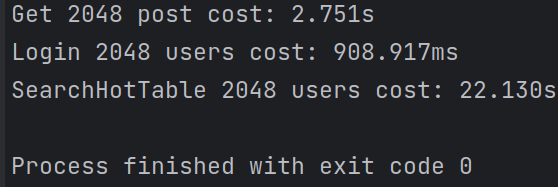
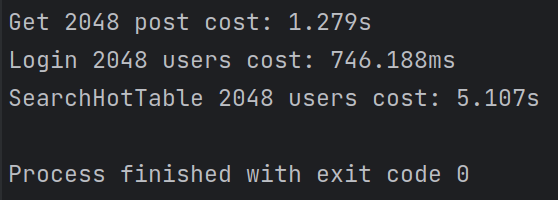
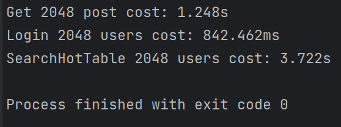
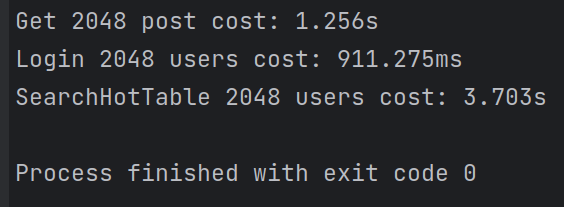
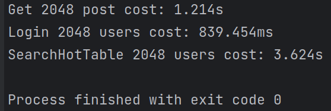
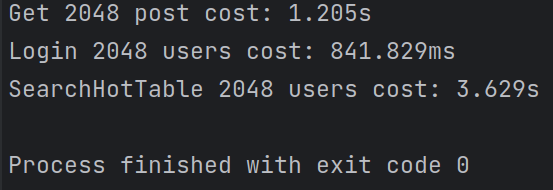

# Project 2

>贾禹帆 栾钦策  

```txt
.
├── currency-test       //web server currency test
├── img
├── project2_intro.pdf
├── report.md
├── report.pdf
├── server              //RESTful web server
└── the-end-bbs         //front end written by Vue.js
```
## Basic

### Objects

#### Object Implementation

The objects are used contain the return data of different queries. They are java class and we use **lombok** to automaticaly generate a *builder* of the class. Here is an example to show how we use it.

- User.java

```java
import lombok.Builder;
import lombok.Data;

@Data
@Builder
public class User {
    String name;
    String password;
    String user_id;
    String registration_time;
    String phone;
}
```

- The usage of class builder

```java
// rs is a result set from jdbc.
return User.builder()
                .name(rs.getString("name"))
                .password(rs.getString("password"))
                .user_id(rs.getString("user_id"))
                .registration_time(rs.getStr("registration_time"))
                .phone(rs.getString("phone"))
                .build();
```

#### Object Details

All the objects:

1. **Post**. Used for getting the whole information of a Post. To store all the replies of this post,  ```ArrayList<Reply>``` is contained in the class.
2. **Reply**. Contains the information of a reply of a post. ```ArrayList<SecReply>``` is contained in the class for storing all the secondary replies of this reply.
3. **SecReply**.  Contains the information of a secondary reply.
4. **SimplePost**. Contains a reduced information of a post. Used for the need of showing many posts in a page, like searching results and hot list.
5. **User**. Contains all the information of an user.

### HTTP/RESTful API

#### Client ask format

- Use method `POST`
- The body format:

```json
{
    "type": $Op, // have 5 basic Op
    "content": [$SubOp, parameter1,parameter2, ...] 
    // parameter depend on SubOp
}
```

#### Server reply format

```json
{
    "content": [reply1, reply2, ...]
}
```

##### Ask&Return format for each Op

>If not specified, the size of retruned content is zero

###### UserOp

- [Login, user_name, password]
  - Return true/talse for whether login success.
- [CreateUser, user_name, password, user_id, user_phone]
  - Return true/false for whether create a new user success.
- [DeleteUser, user_name]
  - Return true/false for whether delete user successfully.
- [ChangePassword, user_name, old_password, new_passwd]
  - Return False if old_password is wrong
  
###### PostOp

- [GetPost, post_id]
  - Return object *Post*.
- [AddPost, title, author_name, city, country, content]
  - Add a post
- [AddReply, post_id, content, author_name]
  - Add a reply under a post
- [AddSecReply, reply_id, content, author_name]
  - Add a secondary reply under a reply

###### SearchOp

*In this OpType, 'limit' and 'offset' is for the front end display.*

- [SearchDefault, keyword, limit, offset]
  - Return ```ArrayList<SimplePost>```. Search the posts with title or content containing the *keyword*.
- [SearchOpt1, keyword, limit, offset]
  - Return ```ArrayList<SimplePost>```. Extend the search range to the reply or secondary reply. The (secondary) reply content is contained in *AppendixContent* of SimplePost object.
- [SearchOpt2, keyword, time_start, time_end, limit, offset]
  - Return ```ArrayList<SimplePost>```. Restrict the posting time to between *time_start* and *time_end*.
- [SearchOpt12, keyword, time_start, time_end, limit, offset]
  - Return ```ArrayList<SimplePost>```. The combination of Opt1 and Opt2.
- [SearchByHot, time_start]
  - Return ```ArrayList<SimplePost>```. Used for getting the hot list. See detail in Advanced->HotTable.

###### RelationOp

- [Like, post_id, user_name]
- [Fav, post_id, user_name] (favourate)
- [Share, post_id, user_name]
- [Follow, followee, follower]
- [DeleteFollow, followee, follower]
  
###### ShowOp

- [ShowFollowers, user_name]
  - Return ```ArrayList<User>```, a list of followers.
- [ShowFollowers, user_name]
  - Return ```ArrayList<User>```, a list of followees.
- [ShowUserPost, user_name]
  - Return ```ArrayList<SimplePost>```.
- [ShowUserReplyPost, user_name]
  - Return ```ArrayList<SimplePost>```, a list of posts that the user replied.

## Advanced

### OpenGauss

Use docker to deploy. To prevent data loss, we use docker's volume to store data. Use `-v ${volume name}:/var/lib/opengauss` option when create container to store OpenGauss's data to a volume. In this way, the data in OpenGauss won't gone when the container is deleted. We could create another new container and mount previous volume to restore data.

### Anonymous reply

Add a boolean column for Reply and Secondary Reply in HDL to represent whether the reply is anonymous. When the client ask for the reply, check whether the reply is anonymous and decied send the author's information or not.

### HotTable

The Hot Table return 10 posts with the highest '**hot index**'. It has an input of *time_start*, which value can be like '1 week before the current time' to get what is hot this week.  
The algorithm of calculating the 'hot index' of a post: Mark all time **like\*1+fav\*2+share\*3** of a post as **hot0**. Mark **like\*1+fav\*2+share\*3** which time is between *time_start* and *current time* of a post as **hot1**. The **hot index** is equal to **hot0 + 100\*hot1**.

### Http/RESTful server

Use Spring Boot's web framework. Core codes are below.

```java
@RestController
public class Handler {
    @Autowired
    private RequestSolver solver;

    @PostMapping(value = "/request")
    public RequestResponse query(@RequestBody ReqBody body) {
        System.out.println("type: " + body.type());
        System.out.println("content: " + body.content());
        try {
            RequestType requestType = RequestType.valueOf(body.type());
            ArrayList requestContent = body.content();
            String op = (String) requestContent.get(0);
            requestContent.remove(0);
            return new RequestResponse(switch (requestType) {
                case UserOp -> solver.solveUserOp(UserOpType.valueOf(op), requestContent);
                case PostOp -> solver.solvePostOp(PostOpType.valueOf(op), requestContent);
                case SearchOp -> solver.solveSearchOp(SearchOpType.valueOf(op), requestContent);
                case RelationOp -> solver.solveRelationOp(RelationOpType.valueOf(op), requestContent);
                case ShowOp -> solver.solveShowOp(ShowOpType.valueOf(op), requestContent);
                default -> new ArrayList();
            });
        } catch (Exception e) {
            return new RequestResponse();
        }
    }
}
```

### Database connection pools

Use Spring Boot's postgres JDBC, which contain connection pools by default, and we can set the conneciton pools size in config file.

### Web GUI

Use Vue.js + BootStrap to write a responsive site, the project is in the folder `./the-end-bbs`. After built, copy the resources into Spring Boot project's "resource/static" folder

### Currency Server

Use node's ansync promise request to test the server's currency performance, result are below:
For tomcat max execution threads:

- 1 thread:

- 5 threads:

- 20 threads:  

- 40 threads:  

- 80 threads:  

- 160 threads:  


>system info:

```txt
CPU: AMD Ryzen 7 6800H with Radeon Graphics (16) @ 3.200GHz 
GPU: AMD ATI Radeon 680M 
Memory: 9790MiB / 13662MiB 
```

When max threads greater than physical threads, there is no more improvement.

